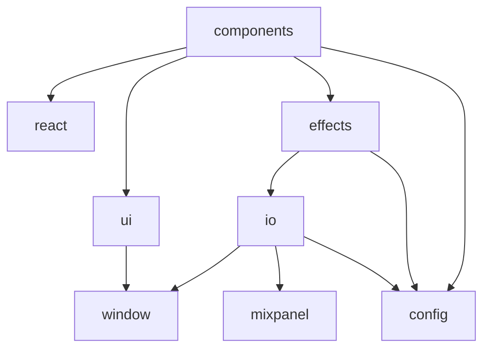

# Charlie Gaffer

    
    <code>572 sloc</code>&nbsp;
    <code>22 files</code>&nbsp;
    <code>3 deps</code>&nbsp;
    <code>13 dev deps</code>

Professional lighting for film and TV.

<!-- START doctoc generated TOC please keep comment here to allow auto update -->
<!-- DON'T EDIT THIS SECTION, INSTEAD RE-RUN doctoc TO UPDATE -->
## Table of Contents

- [Architecture](#architecture)

<!-- END doctoc generated TOC please keep comment here to allow auto update -->

## Architecture

###### 
<em>Can't see the diagram?</em> <a id="link-1" href="https://github.com/mattriley/charlie-gaffer#user-content-link-1">View it on GitHub</a>

